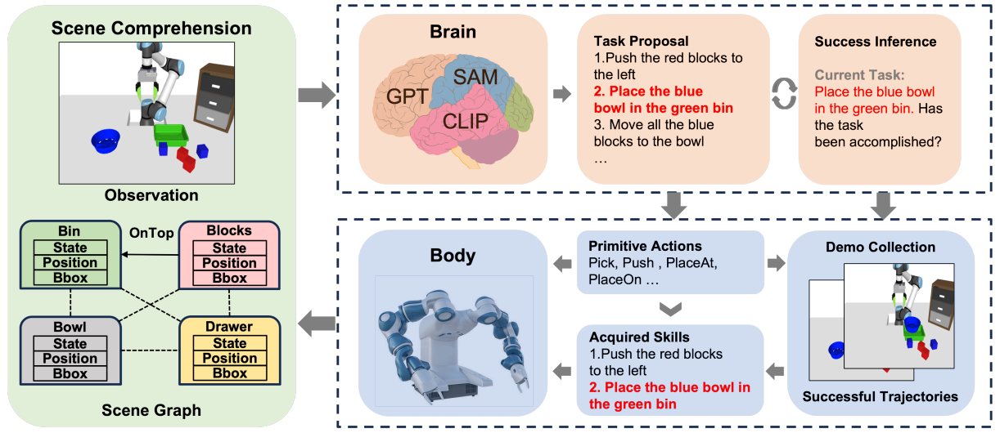

# BBSEA 👴👍👶🏻
Unofficial implementation of [BBSEA: An Exploration of Brain-Body Synchronization for Embodied Agents](https://arxiv.org/abs/2402.08212).

 

## Introduction
The core of BBSEA is a data flywheel that collects trajectories of robotic operations in simulation environments. The overall process of BBSEA is as follows:
- Given a scene represented in RGBD, generate a SceneGraph using YOLO, SAM, and CLIP.
- Feed the SceneGraph to an LLM, which is prompted to proposes tasks that the robot can perform.
- Once a task is proposed, the LLM is then prompted to break it down into several sub-tasks, each of which can be completed with a few pre-defined primitive actions.
- Each primitive action is a hand-coded API that allows the robot to operate in the simulation environment.
- The robot then executes these primitive actions within the proposed task, completing a trajectory.
- After completion, a new scene is generated, so a new SceneGraph can be created. The new SceneGraph is fed back to the LLM to determine if the task has been successfully completed. If successful, the trajectory is saved to a buffer.
- The saved trajectories are used to train downstream policies through behavior cloning.

 

## Motivation of This Repo
Here is the original repo for the [official BBSEA implementation](https://github.com/yangsizhe/bbsea/tree/main). The official implementation of BBSEA is based on the codebase of [Scaling Up and Distilling Down: Language-Guided Robot Skill Acquisition](https://github.com/real-stanford/scalingup), which adopts the simulation environment of [Mujoco](https://mujoco.org/).

However, I've observed a growing preference among Embodied AI researchers for using the simulation environments of [Maniskill](https://maniskill.readthedocs.io/en/latest/) and [Sapien](https://sapien.ucsd.edu/) due to their high rendering quality.

Therefore, I decided to implement BBSEA in Maniskill3 (a beta version of Maniskill). This effort is driven not only by my desire to contribute to the open-source community but also to enhance my engineering skills in conducting Embodied AI research.

 

## Ondoing Checklist

### 🔥 Now I have only relicated the Perception modules and LLM-Interaction modules of BBSEA, the primitive action APIs in Maniskill3 are still on doing...
